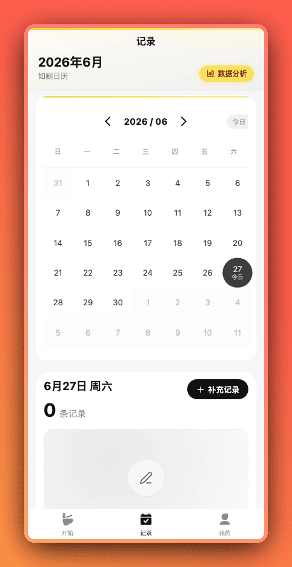
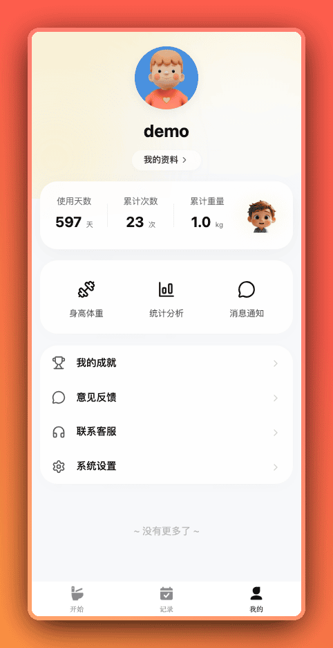

<div align="center">
  
</div>

<h1 align="center">如厕日记 — 帮你读懂便便说的话</h1>

<div align="center">
  <a href="https://ruceriji.com" target="_blank">
    
  </a>
  
  
  
  <br/>
  <a href="./README.en-US.md">English</a> · <strong>简体中文</strong>
</div>

<p align="center">
  <strong>如厕日记</strong> 是一款基于 <strong>uni-app + Vue 3 + TypeScript</strong> 构建的跨平台肠道健康记录应用。帮助用户全面记录、分析排便情况，通过直观的数据可视化和 AI 智能分析，提供个性化的健康建议，促进肠道健康。
</p>

<p align="center">
  <b>开源 · 隐私优先 · 跨平台 · 智能分析</b>
</p>

<p align="center">
  可直接下载 <strong>Android</strong> / <strong>iOS</strong> App，或在微信中搜索小程序 <strong>「如厕日记」</strong> 立即使用。
</p>

> **开源说明**：本仓库目前仅开放客户端源代码，后端服务代码正在筹备开源中。客户端支持打包为 <strong>Android</strong>、<strong>iOS</strong> 和 <strong>微信小程序</strong> 三个平台。

---

## 🖼️ 界面预览

| 如厕记录 | 日历视图 |
|:--------:|:--------:|
|  |  |
| 一键计时 · 多维度记录 · 健康贴士 | 月度概览 · 颜色标记 · 趋势追踪 |

| 个人中心 | 成就系统 |
|:--------:|:--------:|
|  |  |
| 数据看板 · 隐私设置 · 主题切换 | 里程碑徽章 · 趣味称号 · 健康奖杯 |

---

## ✨ 功能特性

### 💩 智能记录与计时

一键开始计时，记录如厕时长，并详细记录便便的各项属性。支持时间、时长、形状、颜色、质地等多维度数据录入。

### 📋 全方位属性分类

支持从多个维度分类记录便便：

- **形状分类** — 基于布里斯托大便分类法可视化展示
- **颜色识别** — 颜色对比参考卡
- **重量与体积** — 近似估算
- **质地与感受** — 主观舒适度评估
- **时长记录** — 精确到秒的耗时统计

每个属性都配有直观的图标和健康小贴士，帮助用户更好地理解肠道健康信号。

### 📅 日历时间线

清晰的日历视图展示每日记录概况。点击任意日期查看详情，轻松发现排便规律和趋势。

- 月度概览，每日记录数一目了然
- 颜色标记快速识别记录状态
- 支持补充遗漏记录
- 左右滑动切换月份

### 📊 数据统计与分析

基于 uCharts 引擎，提供丰富的交互式数据图表：

- **月度频率趋势图**
- **便便形状分布分析**
- **颜色变化追踪**
- **时长统计**
- **每周习惯模式分析**

从日历页点击"数据分析"即可进入。

### 🤖 AI 智能健康洞察

每条记录均可通过 AI 进行深度分析，生成个性化的健康建议：

- **便便特征深度解读**
- **个性化饮食与运动建议**
- **趋势识别与异常预警**
- **通俗易懂的自然语言报告**

AI 分析模块（支持对接多家主流 AI 供应商）将原始数据转化为可执行的健康建议。

### 🏆 成就激励系统

游戏化的成就系统帮助您保持记录习惯：

- **使用里程碑** — 连续 7 天、30 天等
- **记录数量徽章** — 100、500、1000 条记录
- **健康改善奖杯**
- **趣味解锁称号**

成就会自动检测并在应用内以动画效果展示。

### 👤 个人中心与数据统计

个人仪表盘一目了然展示核心指标：

- **使用天数** — 累计活跃天数
- **记录总数** — 累计记录条数
- **预估总重量** — 累计统计
- **身高体重设置** — 个人健康基线

### 🔒 隐私保护

您的数据完全由您掌控，提供多重隐私保护：

- **锁屏密码** — 应用级密码保护
- **生物识别** — 指纹 / Face ID 支持
- **本地优先架构** — 数据在设备端处理
- **隐私优先设计** — 不收集无关数据

### 🌙 深色模式

支持 **浅色**、**深色**、**跟随系统** 三种主题模式，日夜使用都舒适。

### 🌍 国际化

内置多语言支持，一键切换：

- **简体中文**
- **English**（英文）

---

## 📦 下载安装

| 平台 | 下载方式 |
|------|---------|
| **Android** | [应用宝下载](https://sj.qq.com/appdetail/com.ruceriji) |
| **iOS** | App Store 搜索"如厕日记" |
| **微信小程序** | <br/>扫码即用，无需安装 |

> 小程序已覆盖所有核心功能，推荐优先体验 🚀

---

## 🚀 本地开发

> 仅在 **Node.js 20** 环境下测试通过。

```bash
# 克隆仓库
git clone https://github.com/your-org/ruceriji-pro.git
cd ruceriji-pro

# 安装依赖
npm install

# 启动 H5 开发模式（浏览器预览）
npm run dev:h5

# 构建到指定平台
npm run build:mp-weixin      # 微信小程序
npm run build:mp-alipay      # 支付宝小程序
npm run build:h5             # H5 / Web
npm run build:app-android    # Android App
npm run build:app-ios        # iOS App

# 代码质量检查
npm run lint                 # ESLint 检查
npm run format               # Prettier 格式化
```

### 开发命令速览

| 命令 | 说明 |
|------|------|
| `npm run dev:h5` | 启动 H5 开发服务器 |
| `npm run dev:mp-weixin` | 微信小程序开发模式 |
| `npm run dev:app` | App 开发模式（Android/iOS） |
| `npm run build:custom` | 自定义平台构建 |
| `npm run check` | 格式化 + 代码检查 |

## 💬 加入交流群

> 添加好友请备注 **如厕日记**

| 微信交流群 | QQ 交流群 |
|:----------:|:---------:|
|  |  |

---

## 📄 开源协议

本项目基于 [Apache-2.0](./LICENSE) 协议开源。


